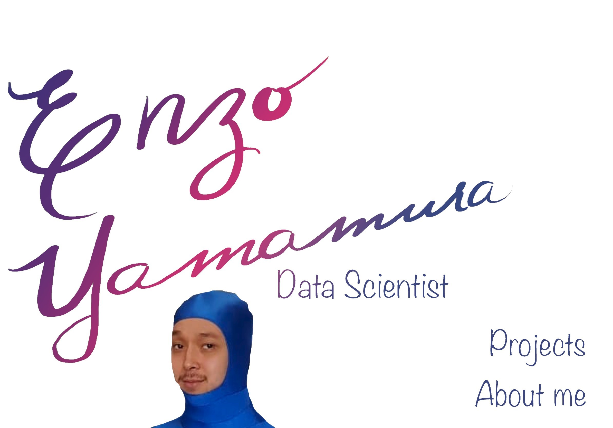

# Hello folks!  ( ͡° ͜ʖ ͡°) 

My name is Enzo Yamamura and I'm a weirdo and enthusiastic about *everything data*!
I live in Sao Paulo, Brazil and am currently looking to jumpstart my career in Data.
Here you'll find both my personal and course projects as I progress towards my goals!

You can find me on [![Instagram][1.2]][1], or on [![LinkedIn][2.2]][2].

<!-- Icons -->

[1.2]: images/instagram.png (instagram icon)
[2.2]: images/linkedin.png (LinkedIn icon without padding)

<!-- Links to your social media accounts -->

[1]: https://www.instagram.com/yamamuraenzo/
[2]: https://www.linkedin.com/in/enzoyamamura/

___
# :wrench: Skills and Tools 

 

    
___
# :chart_with_upwards_trend:  GitHub Stats

  

